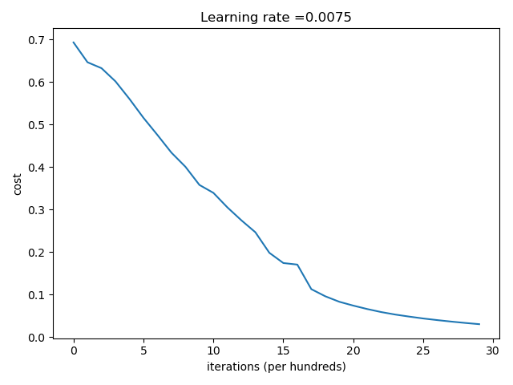

L-hidden layers NN from Andrew NG's Coursera deelearning.ai 

## Learning Curve for 1 hidden layer network  

## 1 hidden layer network Train/Test accuracy over 2500 iterations
1.0/0.72

## 3 hidden layer network Train/Test accuracy over 2500 iterations
0.986/0.8

